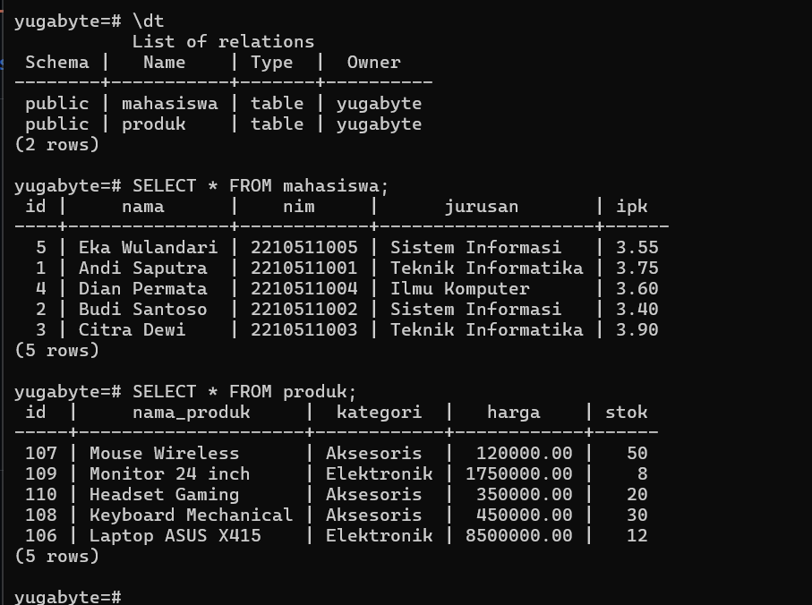
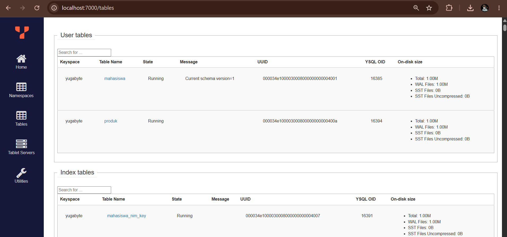
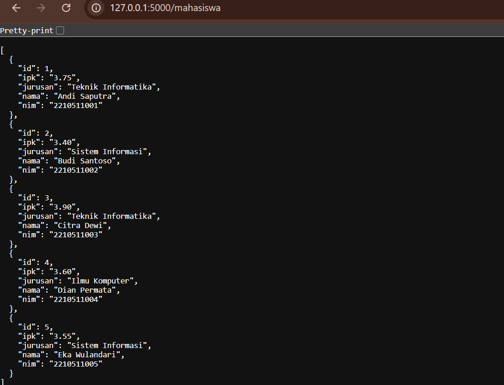
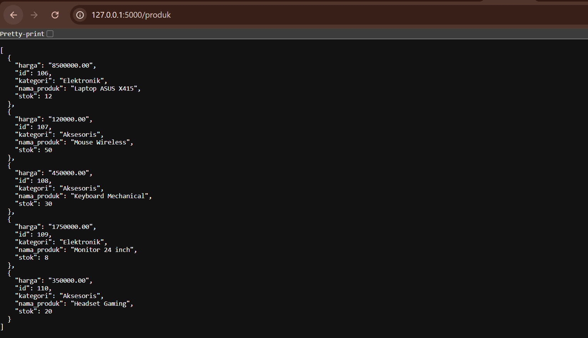
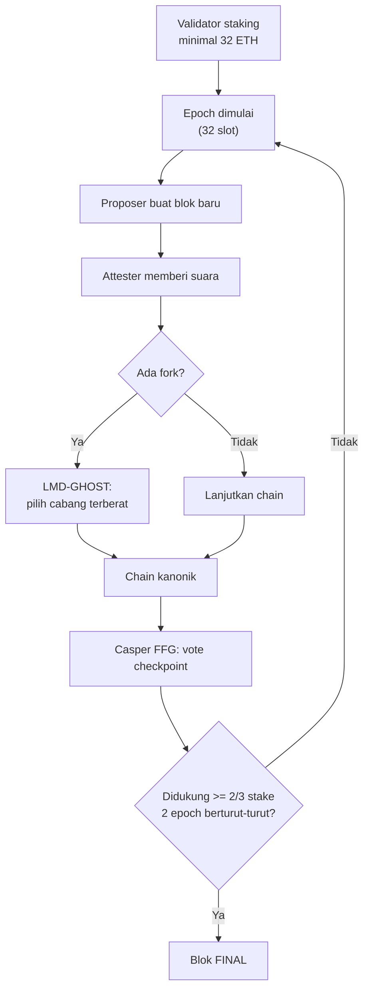

# Responsi DisDec Sys

## Soal 1 (CPMK 1 – 20%): Menjalankan YugabyteDB dengan Docker

### Langkah pengerjaan

1. **Jalankan container YugabyteDB.**
```bash
   docker compose up -d
```

2. **Cek container berjalan.**
```bash
   docker ps
```

3. **Masuk ke `ysqlsh` di dalam container.**
```bash
   docker exec -it yugabytedb ysqlsh -h localhost
```

4. **Jalankan script pembuatan tabel & pengisian data** (`sql/init.sql`).

5. **Bukti tabel & data berhasil dibuat:**
```sql
   \dt
   SELECT * FROM mahasiswa;
   SELECT * FROM produk;
```

> Detail tabel: lihat `sql/init.sql` — 2 tabel (`mahasiswa` dan `produk`), masing-masing diisi 5 baris data.

### Bukti Soal 1



---


## Soal 2 : REST API dengan Python

Kode ada di folder `api/`.

### Langkah pengerjaan

1. **Install dependency:**
```bash
   cd api
   pip install -r requirements.txt
```

2. **Jalankan API:**
```bash
   python app.py
```

3. **Uji lewat browser atau curl:**
```bash
   curl http://localhost:5000/mahasiswa
   curl http://localhost:5000/produk
```

### Bukti Soal 2
   
   

---


## Soal 3 : Mekanisme Konsensus Blockchain L1 — Ethereum (Proof of Stake / Gasper)

Blockchain L1 yang dipilih: **Ethereum**, menggunakan **Proof of Stake (PoS)** dengan protokol **Gasper** (gabungan LMD-GHOST + Casper FFG).

### Cara kerja singkat

1. **Staking.** Validator mengunci minimal 32 ETH.
2. **Proposer & Attester.** Setiap slot (12 detik), satu validator jadi proposer blok, validator lain memberi suara (attestation).
3. **LMD-GHOST** memilih cabang/fork dengan bobot suara terbanyak.
4. **Casper FFG** memberi finality permanen pada checkpoint tiap akhir epoch (32 slot) jika didukung ≥2/3 total stake, dua epoch berturut-turut.
5. **Slashing** memotong stake validator yang curang.

### Diagram mekanisme konsensus



---

## Struktur Repo

```
responsi-disdec-sys/
├── README.md
├── docker-compose.yml
├── sql/init.sql
├── api/
│   ├── app.py
│   └── requirements.txt
└── docs/screenshots/
```
